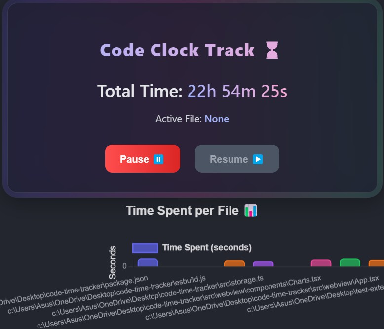
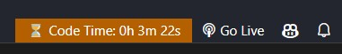

# 🎯 Code Time Tracker

Welcome to **Code Time Tracker** – a sleek, lightweight, and powerful **VS Code extension** designed to help you track and analyze your coding time effortlessly. Stay productive, gain insights, and boost your efficiency with real-time tracking! 🚀

---

## ✨ Features at a Glance

### ⏳ **Real-Time Tracking**
✔️ Automatically logs time spent on each file.  
✔️ Dynamic updates as you work – no manual input needed!

### 📊 **Visual Analytics & Insights**
✔️ **Live Timer Widget** displaying:
   - ⏲️ Total coding time
   - 📂 Active file being edited
   - ⏸️ Pause & ▶ Resume buttons
✔️ **Bar Chart Visualization** – see coding time per file.
✔️ **Status Bar Clock** – always visible in VS Code.

### 🎯 **Pause & Resume Tracking**
✔️ Need a break? **Pause** the tracker anytime.  
✔️ Hit **Resume** when you’re back at it.  
✔️ Ensures precise time logging.

### 📌 **Persistent Data Tracking**
✔️ Logs persist even after restarting VS Code.  
✔️ Helps maintain long-term coding activity records.

### ⚡ **Lightweight & Non-Intrusive**
✔️ Runs efficiently in the background.  
✔️ No performance slowdowns, just seamless tracking.

---

## 📊 Visual Analytics & Insights

## 🚀 Installation

1. Open **Visual Studio Code**.
2. Go to the **Extensions Marketplace**.
3. Search for `Code Time Tracker`.
4. Click **Install**.
5. Activate the extension by running `Show Code Time Tracker` from the Command Palette (`Ctrl+Shift+P` / `Cmd+Shift+P`).

---

## 📌 How to Use

### 🎬 **Step 1: Launch the Timer Widget**
🔹 Open the **Command Palette** (`Ctrl+Shift+P` / `Cmd+Shift+P`).  
🔹 Type `Show Code Time Tracker` and select it.  
🔹 The **Timer Widget & Chart** will appear in a webview panel.

### 🎯 **Step 2: Start Coding & Track Time**
🟢 Open any file and begin coding.  
🟢 **Total Time** updates dynamically.  
🟢 The **Active File** section shows the file you’re editing.  
🟢 The **Bar Chart** visualizes time spent per file.

### ⏸ **Step 3: Pause & Resume Tracking**
⏸ Click **Pause** to stop tracking temporarily.  
▶ Click **Resume** to continue logging time.

### ⌛ **Step 4: Monitor Time in the Status Bar**
📌 A **Status Bar Clock** shows total coding duration.  
🖱 Hover over it for additional insights.

---

## 🛠 Extension Settings
This extension provides the following customizable settings:

- `codeTimeTracker.enable`: ✅ Enable/disable time tracking.
- `codeTimeTracker.resetTime`: 🔄 Manually reset tracked time.

---

## 🚀 Upcoming Features
🔹 **Project-based Time Tracking** – monitor time per project!  
🔹 **Custom Reports** – export data for better productivity analysis.  
🔹 **Dark Mode Support** – for an even sleeker UI.  

---

## ⚠ Known Issues
- ⏳ The timer may reset if VS Code crashes unexpectedly.  
- 📁 Performance may vary on very large projects.

---

## 📜 Release Notes

### 🔥 **Version 1.1.0** (Latest)
✔️ Added **Status Bar Clock**.  
✔️ Improved performance and UI responsiveness.  

### 🚀 **Version 1.0.0**
✔️ Initial release of Code Time Tracker.

---

## 💡 Contributing
We ❤️ open-source contributions! If you’d like to enhance this extension, feel free to submit a **pull request** or open an **issue** on [GitHub](https://github.com/Hiteshydv001/CodeClock/issues).  

---

## 💬 Need Help?
For issues, feature requests, or support, visit our [GitHub Repository](https://github.com/Hiteshydv001/CodeClock/issues).  

---

## 📜 License
This extension is released under the [MIT License](LICENSE).

---

🚀 **Happy Coding with Code Time Tracker!** ⏳💻

